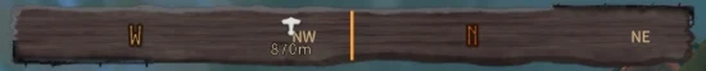
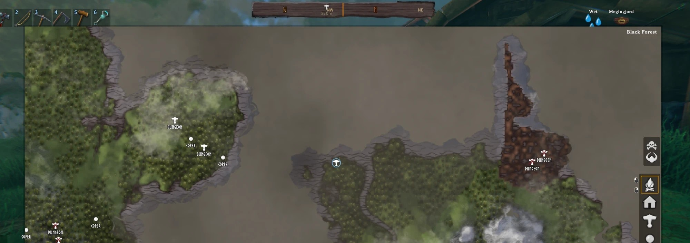

# Valheim Nav Compass

BepInEx mod for [Valheim](https://www.valheimgame.com/) that adds a
scrolling compass strip to the top of the HUD, showing cardinal directions
and the bearing/distance to map pins you've manually marked - like the
navigation compass in many other open-world games. This is **not**
auto-pathfinding, just a visual direction indicator.

> **Unofficial mod.** This is a fan-made mod, not affiliated with or endorsed by
> Iron Gate. It marks your game as modded (the game shows this in the main menu),
> as Iron Gate asks mod authors to do.

## Screenshots





## How to use

Open the map and click a pin to cycle its state:

1. **Unmarked** (default)
2. **Strikethrough** (the game's own built-in "checked" mark)
3. **Circled** (a thin light-blue ring, added by this mod) - this pin now
   shows up on the compass strip
4. Click again -> back to unmarked

Works on *any* pin, including ones the game places automatically (bosses,
trader/shop markers, etc.) - not just ones you placed yourself. You can
track multiple pins at once. Marked pins are saved per-world in
`BepInEx\config\NavCompass\` and survive a game restart and mod updates.
A mark stays even while its pin is temporarily off the map (e.g. a category
hidden in Auto Waypoints) and comes back with it; it is removed only when you
delete the pin yourself.

Under each tracked pin's icon the compass shows the distance, and the pin's
name when it has one (translated like on the map). With
[Auto Waypoints](https://github.com/Ab5oluteZer0/valheim-auto-waypoints)
installed, the name follows its label settings: if a pin's label is hidden on
the map, the compass shows just the distance. Nav Compass works on its own
too - Auto Waypoints is optional.

## Look

The compass strip is styled to match the game's own UI: it sits in the same
wooden frame as the in-game windows, and the main directions (N, E, S, W)
are carved-wood letters in Valheim's Norse font (north is tinted red so it
stands out). All of these graphics are taken from your installed game at
runtime - the mod itself ships no game assets. If any of them can't be
found, the compass falls back to a plain look instead of failing.

## Requirements

- Valheim (tested on 1.0.15)
- [BepInEx](https://valheim.thunderstore.io/package/denikson/BepInExPack_Valheim/) 5.4.x

## Installation (players)

1. Install BepInEx for Valheim if you haven't already (see link above, or
   use [r2modman](https://valheim.thunderstore.io/package/ebkr/r2modman/)).
2. Download `NavCompass.dll` from the
   [latest release](../../releases/latest).
3. Drop it into `<Valheim install folder>\BepInEx\plugins\NavCompass\`.
4. Launch the game, mark a pin on the map, close the map.

**Upgrading from 0.1.x:** the DLL used to be called `Mod6-NavCompass.dll`.
Delete the old `BepInEx\plugins\Mod6-NavCompass\` folder after installing
the new version - your marked pins are copied over automatically the first
time you load each world.

## Building from source

Requires the [.NET 8 SDK](https://dotnet.microsoft.com/download) (or newer)
and a local Valheim install with BepInEx installed.

```bash
git clone https://github.com/Ab5oluteZer0/valheim-nav-compass.git
cd valheim-nav-compass
dotnet build -c Release -p:ValheimPath="C:\Path\To\Valheim"
```

If you don't pass `-p:ValheimPath`, the build looks for a `VALHEIM_PATH`
environment variable, then falls back to the default Steam location
(`C:\Program Files (x86)\Steam\steamapps\common\Valheim`).

The build automatically copies the built DLL into
`<Valheim>\BepInEx\plugins\NavCompass\` for quick in-game testing.

## Notes on how it works (and a few gotchas found along the way)

- Pin marking does **not** reuse `Minimap.GetClosestPin` - that method
  requires `pin.m_save == true`, which excludes non-saveable pins like
  shop/trader markers. This mod re-implements the closest-pin lookup without
  that restriction.
- `PinData.m_checked` is the game's own field for the red "strikethrough"
  look (not a checkmark, despite the name) and is toggled automatically on
  every map click - this mod explicitly overwrites it after each click to
  fit its own 3-state cycle.
- Deleting a marked pin from the map (right-click -> remove) is detected
  every frame and cleans up the mod's own tracking state, so it doesn't get
  stuck showing a pin that no longer exists.
- Any `Update()` loop that builds UI dynamically should be wrapped in a
  try/catch with a "disable after first error" guard - an uncaught exception
  thrown every frame floods the BepInEx log and tanks FPS by itself.

## Support

All my mods are free and will stay free. If you enjoy them and want to say
thanks, you can leave a voluntary tip via [PayPal](https://www.paypal.com/ncp/payment/4JQUSHTJGBAG6) - it doesn't
unlock anything, it just helps me keep making mods.

## License

MIT - see [LICENSE](LICENSE).
